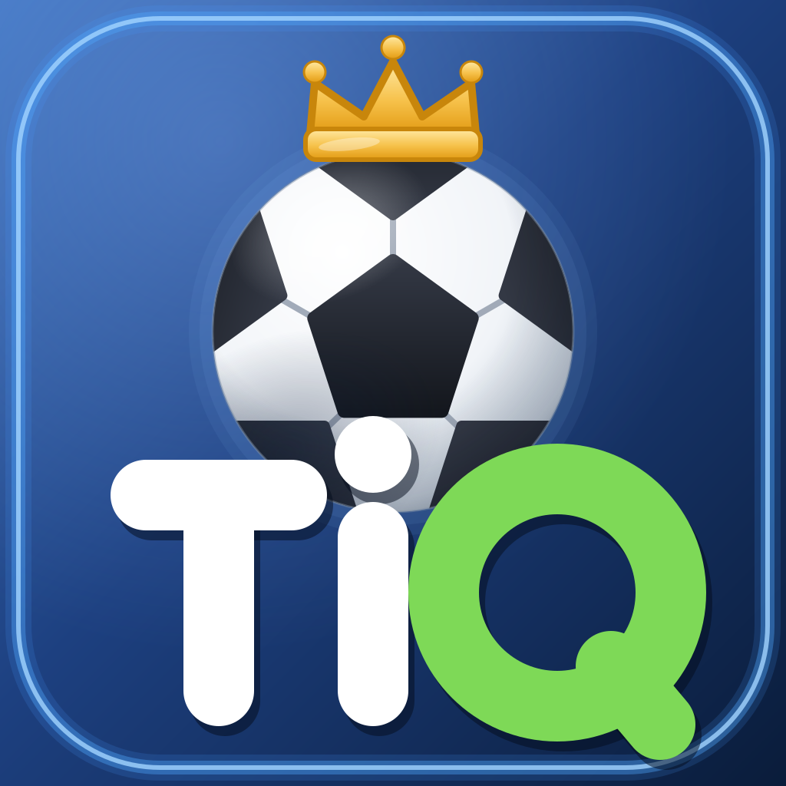

# ⚽ TiQ — سؤال الكرة اليومي

<p align="center">
  
</p>

**TiQ** لعب كرة قدم يومي: سؤال جديد كل يوم لكل المستخدمين، سلسلة أهداف، نقاط خبرة، مستويات، إنجازات، ووضع تدريب. تطوير **Malek**.

---

## المزايا

| | |
|---|---|
| 🗓️ **سؤال يومي ثابت** | محدد بتجزئة التاريخ — نفس السؤال لكل العالم، بخلط خيارات ثابت |
| 🔥 **سلسلة يومية** | صح متتالي يكمل السلسلة، مع مراحل 3/7/14/30/50/100 يوم |
| ⭐ **XP ومستويات** | نقاط خبرة حسب الصعوبة (10/20/35) + مكافأة سلسلة، و6 مستويات من مبتدئ إلى أسطورة |
| 🏆 **10 إنجازات** | تُفتح تلقائيًا مع تقدمك، مع إشعار لحظة الفتح |
| 🎓 **وضع تدريب** | 5 أسئلة عشوائية متتالية — بلا أثر على سلسلتك |
| 🌐 **عربي/English** | واجهة و**أسئلة** كاملة بلغتين، مع تبديل RTL/LTR تلقائي |
| 🔔 **تذكير 10 مساءً** | إشعار أصلي يومي (APK) حتى لو كان التطبيق مغلقًا |
| 🔐 **دخول بجوجل** | شاشة ترحيب داكنة فاخرة: Google Sign-In + ضيف + بريد + شروط استخدام |
| ☁️ **مزامنة سحابية** | حساب عبر Supabase: بياناتك تتبعك على كل جهاز |
| 🌙 **ثيم كامل** | نهاري/ليلي/النظام — بلا وميض عند الإقلاع |

## المعمارية (v3)

هيكل طبقي معياري — كل طبقة تعرف ما تحتها فقط:

```
src/
├── core/          # الأساسيات: config, storage (نسخ/ترحيل), store (خارجي), date
├── domain/        # منطق اللعبة النقي: types, dailyEngine, progression
├── data/          # بنك الأسئلة الثنائي اللغة (32 سؤالًا)
├── stores/        # حالة التطبيق: progressStore, prefsStore
├── lib/           # خدمات: i18n, feedback (صوت/هابتيك/كونفيتي), backend (Supabase), notifications
├── hooks/         # خطافات الربط: useAppStores
└── components/
    ├── ui/        # عناصر قابلة لإعادة الاستخدام: primitives, Sheet
    └── ...        # ميزات: QuestionCard, TrainingMode, AchievementsPanel...
```

مبادئ التصميم:
- **منطق نقي قابل للاختبار** — محرك التقدم واليوم بلا تأثيرات جانبية.
- **متاجر خارجية** عبر `useSyncExternalStore` — تحديثات دقيقة بلا مكتبات حالة.
- **ترحيل تلقائي** — بيانات الإصدارات القديمة تُرحَّل ولا تُفقد.
- **i18n مطبَّع الأنواع** — إضافة مفتاح ترجمة يُلزم كل اللغات بتوفيره.

## التشغيل

```bash
bun install        # أو npm install
bun run dev        # خادم التطوير
bun run build      # بناء الإنتاج → dist/
bun run typecheck  # فحص الأنواع
```

## بناء APK (أندرويد)

يُبنى تلقائيًا عبر GitHub Actions عند كل push إلى `main` — الملف الناتج في **Actions → Artifacts → app-debug**.

الأذونات المطلوبة ممنوحة في الـ workflow: إشعارات (`POST_NOTIFICATIONS`)، منبهات دقيقة، والاستيقاظ عند الإقلاع.

## الإعداد السحابي (اختياري)

1. أنشئ مشروعًا مجانيًا على [supabase.com](https://supabase.com)
2. شغّل `supabase/schema.sql` في SQL Editor
3. أضف `VITE_SUPABASE_URL` و `VITE_SUPABASE_ANON_KEY` في إعدادات البيئة

بدون مفاتيح، يعمل التطبيق بوضع محلي كامل (شاشة الترحيب تُخفى تلقائيًا).

### تفعيل تسجيل الدخول بجوجل

1. في [Google Cloud Console](https://console.cloud.google.com) أنشئ OAuth Client ID (Web):
   - Authorized origins: نطاق تطبيقك + `https://<PROJECT>.supabase.co`
   - Authorized redirect URI: `https://<PROJECT>.supabase.co/auth/v1/callback`
2. في Supabase → Authentication → Providers → Google: الصق Client ID و Client Secret وفعّل المزود.
3. لأندرويد (APK): أضف في Authentication → URL Configuration:
   - Redirect URLs: `com.malek.tiq://login-callback`
   - في `android/app/src/main/AndroidManifest.xml` يجب أن يملك التطبيق نفس الـ scheme (يولّده Capacitor تلقائيًا من `appId`).

## الترخيص

MIT — راجع [LICENSE](LICENSE).
